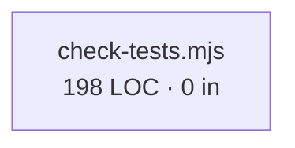

# Connection Graph — scripts/ts-pipeline/test-coverage-guard/scripts

> Auto-generated. Hash: `6d2d693` · Last: `2026-08-24`
> Files: 1 · Edges: 0 · Orphans: 1 · Violations: 0

## Intra-folder graph

## Inbound index

| File | Inbound | Top importers |
|------|---------|---------------|
| `check-tests.mjs` | 0 |  |

## Outbound index

| File | Outbound | Top dependencies |
|------|----------|------------------|
| `check-tests.mjs` | 0 |  |

## Findings

- **Orphans (1):** `scripts/ts-pipeline/test-coverage-guard/scripts/check-tests.mjs`
