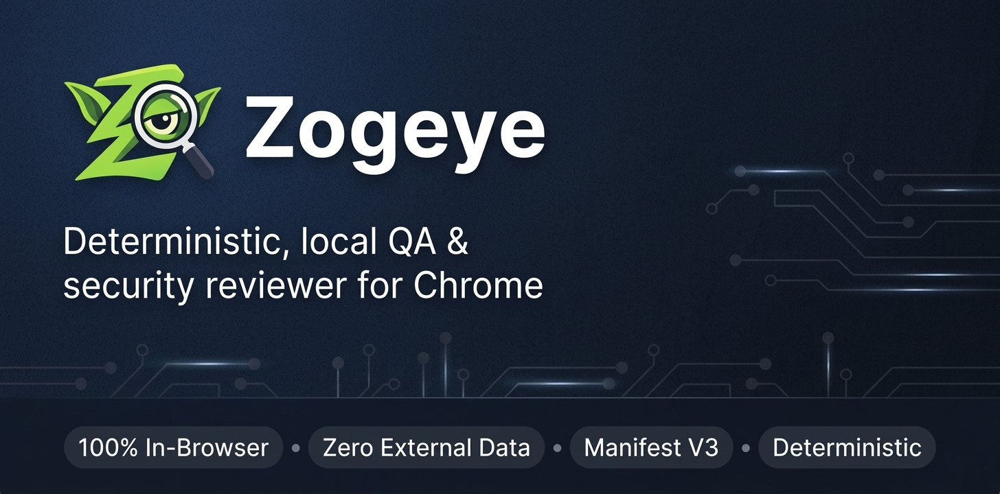

# Zogeye

[](public/manifest.json)
[](#license)
[](#development)
[](#whatcha-think)

_Your in-browser QA reviewer for API traffic, headers, and project files — deterministic, local, and account-free._


Zogeye is a Chrome (Manifest V3) extension that reviews the active tab — its network traffic, its
response headers, its DOM, and even a local project folder — against a fixed rule set, entirely in
your browser. No account, no backend, no data sent anywhere: every rule runs in-browser and results
live in `chrome.storage` and in-memory stores. Same inputs, same findings, every time.

> **Status:** not yet on the Chrome Web Store. Load it as an unpacked extension — see [Installation](#installation).

## Features

- **Deterministic by design:** every scan produces a `Report` with a numeric **risk score** and an **exposure** tier (`low` / `medium` / `high` / `critical`), using fixed severity weights (`info` 0, `low` 1, `medium` 5, `high` 20, `critical` 50) and de-duplicated findings.
- **Network & API review:** flags non-HTTPS API traffic, credentials in query params, mutations sent via GET, JSON bodies without `application/json`, and wildcard CORS with `Access-Control-Allow-Credentials: true` — over captured `fetch` / XHR / `sendBeacon` / WebSocket / EventSource traffic.
- **Request hygiene:** catches JWTs and HTTP Basic credentials in the URL, session/OAuth tokens as URL params, PII in the query string, and `Authorization` sent over cleartext HTTP.
- **GraphQL & realtime:** GraphQL over HTTP, queries in GET URLs, mutations via GET, introspection in requests, deprecated subscription transport, and insecure `ws://` sockets.
- **Headers & cookies:** real `chrome.webRequest` response headers checked for weak/missing HSTS, missing or unsafe CSP, missing `nosniff`, missing frame protection, version disclosure, cacheable authenticated responses, and `Set-Cookie` missing `Secure` / `SameSite` / `HttpOnly`.
- **DOM / page scan:** on-demand snapshot flags password fields on insecure pages, mixed content, cross-origin scripts without SRI, unsandboxed cross-origin iframes, `target="_blank"` without `rel="noopener"`, inline handlers, `javascript:` URIs, and leaky referrer policy.
- **Static project scan:** point it at a local folder — it filters to source files, skips `node_modules` / `dist` / lockfiles (max 2000 files, 512 KB each), and flags `eval(`, `document.write(`, `innerHTML =`, hardcoded HTTP endpoints, likely secrets, wildcard `postMessage`, tokens in `localStorage`, and outdated libraries. `package.json` deps are checked too (`moment`, `request`, `angular`, `subscriptions-transport-ws`; `axios` < 0.21.4, `lodash` < 4.17.21, `jquery` < 3.5.0).
- **Performance:** deterministic latency analysis over captured requests (static assets excluded) — slow-call tiers (1s / 3s / 8s), per-peer outliers (≥5 samples, ≥3× median, ≥500 ms), and the slowest calls above 200 ms.
- **Recorder:** records a deterministic set of user actions (`navigate`, `click`, `change`, `keydown`, `submit`) into named, stored flows with start / stop / rename / delete.
- **Storage snapshots:** capture a tab's `localStorage`, `sessionStorage`, and cookies (all, or a hand-picked subset) and switch back to any saved snapshot later.
- **Search everywhere:** build a one-shot corpus from the active tab — page source, cookies, captured requests, `localStorage`, `sessionStorage` — and filter it with case-sensitive, regex, and per-source-kind options.

## Installation

Zogeye isn't published yet, so you build it and load it unpacked.

### Build

```bash
npm install
npm run build        # tsc + copy assets into dist/
```

### Load in Chrome

1. Open `chrome://extensions`
2. Enable **Developer mode**
3. Click **Load unpacked** and select the `dist/` folder

Works on Chromium browsers targeting Chrome MV3; Edge and other Chromium builds are untested.

## Getting Started

1. Open the **Zogeye side panel** from the extensions menu.
2. Browse the site you want to review — Zogeye captures traffic and headers as you go.
3. Run a scan from the side panel to get the risk score and findings for the active tab.
4. Optionally trigger the **DOM scan**, point the **static scan** at a local folder, or start the **recorder**.

## Configuration

There's nothing to configure. Zogeye runs great with zero setup — the rule set is fixed, severity
weights are fixed, and results are deterministic out of the box.

It requests these permissions: `storage`, `sidePanel`, `tabs`, `webRequest`, `cookies`, and
`host_permissions: <all_urls>` (content scripts run on every page to observe DOM and network activity
locally).

## Development

```bash
npm run watch        # tsc --watch
npm run typecheck    # tsc --noEmit
npm run test:unit    # vitest, *.unit.test.ts
npm run test:int     # vitest, *.int.test.ts
npm run verify       # full staged pipeline
npm run verify:fast  # stages 1-4 (pre-commit scope)
```

`npm run verify` runs, in cost order: TypeScript compile, ESLint (`--max-warnings 0`), test-coverage
guard, dead-code gate, unit tests, integration tests, e2e, `npm audit`, gitleaks (skipped if not
installed), framework rules, and dependency-architecture validation.

### Architecture

Layered code with import boundaries enforced by ESLint and `dependency-cruiser`:

- `src/domain/` — pure models and rules, no `chrome.*`
- `src/application/` — the analyzer and rule registry
- `src/infrastructure/` — `chrome.storage`-backed stores
- `src/background/` — service worker glue
- `src/content/` — content scripts (`relay`, `network-hook`, `page-scan`, `recorder`)
- `src/sidepanel/` — side panel UI glue

TypeScript is strict (`noUncheckedIndexedAccess`, `exactOptionalPropertyTypes`, `noImplicitOverride`,
`noEmitOnError`, …). ESLint bans `any`, non-null assertions, and `JSON.parse(x) as T`, and forbids
`domain` / `application` from importing infrastructure, `node:fs`, or vendor SDKs.

## Whatcha think?

Zogeye is open source and still pre-release — feedback is very welcome. Open a GitHub issue with
what worked, what produced a false positive, or a rule you wish existed.

## License

ISC (per `package.json`). A `LICENSE` file has not yet been added to the repository.
